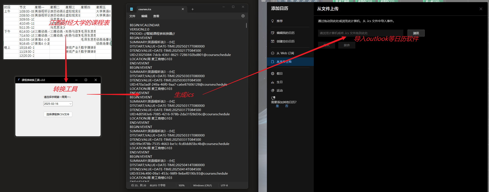

# 江西财经大学课程表csv转sci工具

将江西财经大学的课程表转换成sci方便导入日程的工具，csv需要手动从网站上复制到excel表格中，然后另存为csv。

大部分代码使用DS完成。

注意，现在只适配了江西财经大学学生的课程表，技术有限，使用硬编码（比如第一节课只能是08:00-08:45，不是识别表格），其他格式课程表没有经过任何测试，结果未知。

# 示例

## 以下是示例csv表格：

[原始课程表csv文件](./file/courses.csv)

| 时段 | 节次 | 星期一 | 星期二 | 星期三 | 星期四 | 星期五 | 星期六 | 星期日 |  |
|---|---|---|---|---|---|---|---|---|---|
| 上午 | 1(08:00-08:45) | 英语视听说3 小红(1-16单周 麦工商楼G103) | 游历动画设计 小白(1-16 麦萃庐C310) | 虚拟现实设计基础 小汪(1-16 麦萃庐C211) |  | 大学英语III 小张(1-16 麦一教1305) |  |  |  |
|  | 2(08:50-09:35) | 英语视听说3 小红(1-16单周 麦工商楼G103) | 游历动画设计 小白(1-16 麦萃庐C310) | 虚拟现实设计基础 小汪(1-16 麦萃庐C211) |  | 大学英语III 小张(1-16 麦一教1305) |  |  |  |
|  | 3(09:55-10:40) |  | 马克思主义基本原理概论 小王(1-16 麦二教2104) |  |  |  |  |  |  |
|  | 4(10:45-11:30) |  | 马克思主义基本原理概论 小王(1-16 麦二教2104) |  |  |  |  |  |  |
|  | 5(11:35-12:20) |  | 马克思主义基本原理概论 小王(1-16 麦二教2104) |  |  |  |  |  |  |
| 下午 | 6(14:00-14:45) | 三维动画 小汪(1-16 麦萃庐C211) | 三维动画 小汪(1-16 麦萃庐C211) | 形势与政策IV 小黑(9-12 麦三教3405) | 毛泽东思想和中国特色社会主义理论体系概论 小蓝(1-16 麦二教2105) |  |  |  |  |
|  | 7(14:50-15:35) | 三维动画 小汪(1-16 麦萃庐C211) | 三维动画 小汪(1-16 麦萃庐C211) | 形势与政策IV 小黑(9-12 麦三教3405) | 毛泽东思想和中国特色社会主义理论体系概论 小蓝(1-16 麦二教2105) |  |  |  |  |
|  | 8(15:55-16:40) | 体育4 小龙(1-16 麦羽毛球场T047) |  |  | 毛泽东思想和中国特色社会主义理论体系概论 小蓝(1-16 麦二教2105) | 动画场景设计 小灰(1-16 麦萃庐C211) |  |  |  |
|  | 9(16:45-17:30) | 体育4 小龙(1-16 麦羽毛球场T047) |  |  |  | 动画场景设计 小灰(1-16 麦萃庐C211) |  |  |  |
| 晚上 | 10(18:40-19:25) |  |  | 游戏产业与游戏文化 小高(1-16 麦三教3313) | 数字媒体研究方法论 小高(1-16 麦一教1412) |  |  |  |  |
|  | 11(19:30-20:15) |  |  | 游戏产业与游戏文化 小高(1-16 麦三教3313) | 数字媒体研究方法论 小高(1-16 麦一教1412) |  |  |  |  |
|  | 12(20:20-21:05) |  |  |  |  |  |  |  |  |

[生成的ics文件](./file/courses.ics)

然后就可以导入日历软件了，大部分日历都是支持导入的。

# TODO:

- [ ] 添加日期记忆功能，再次打开默认选择上次的日期
